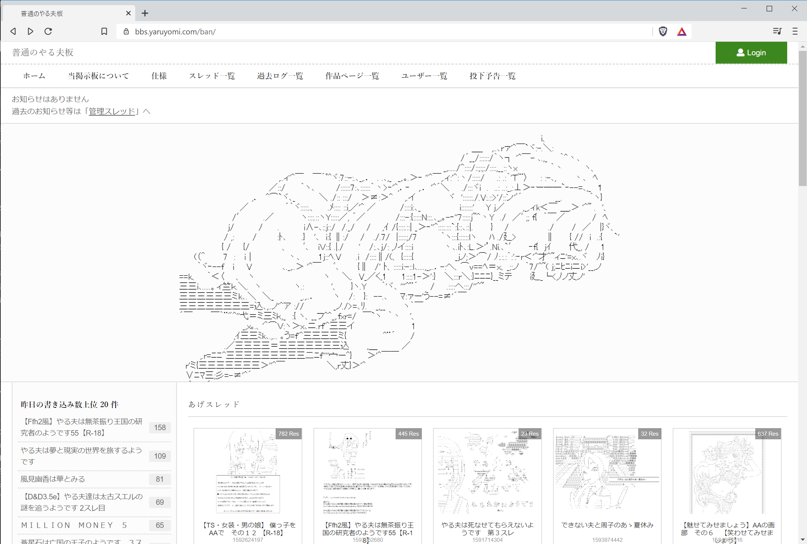
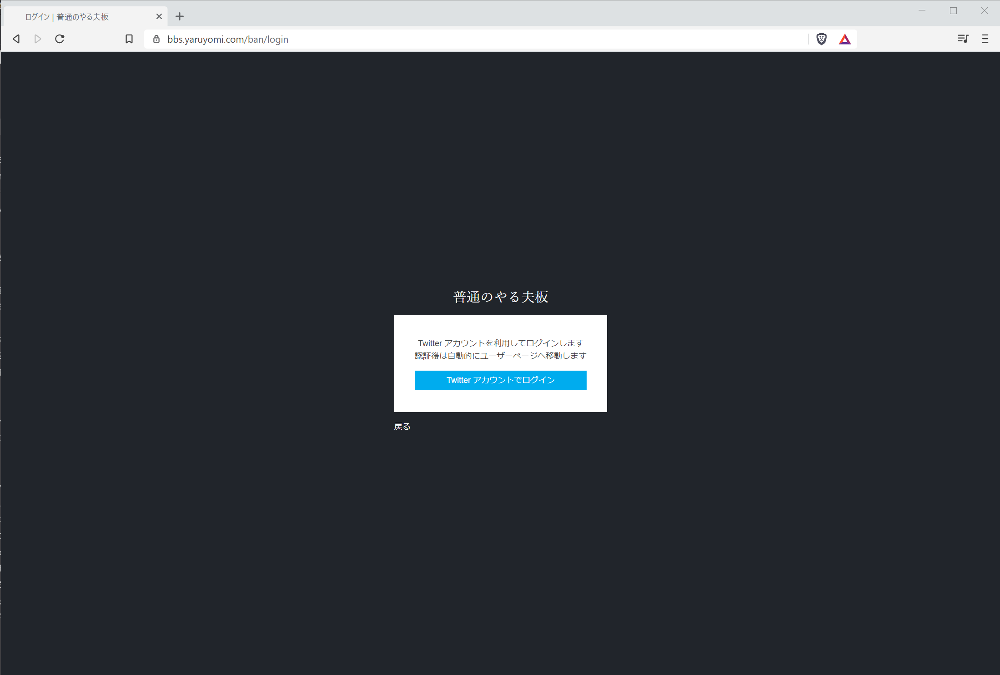
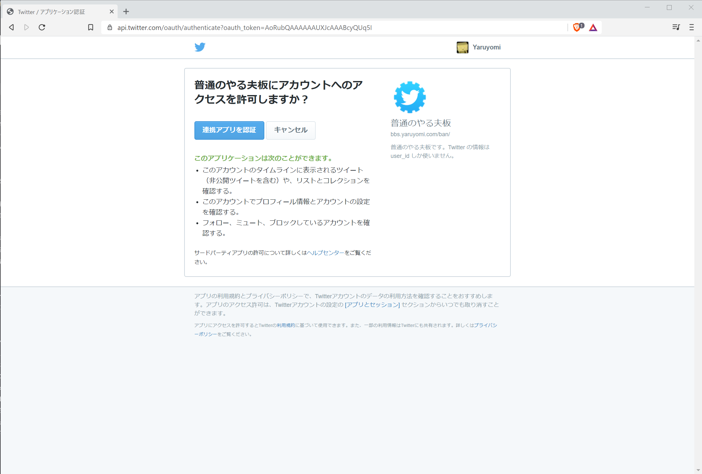
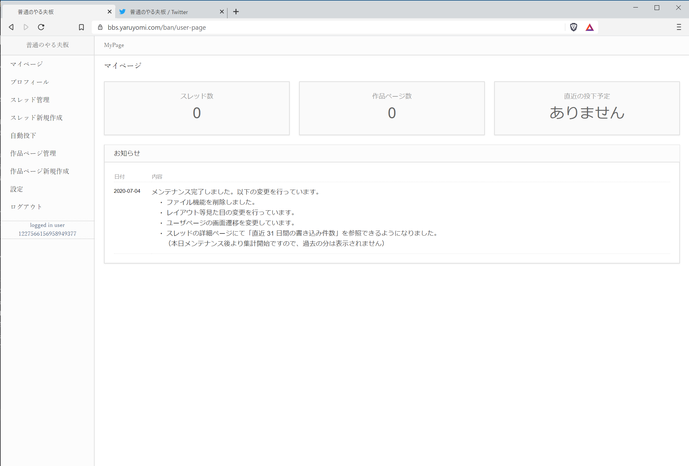

################################
ユーザーページへのログイン方法
################################

サイトを表示
**********************************

サイトへアクセスし、画面右上にある「Login」ボタンを押下します。

ログイン
**********************************

| ログイン画面が表示されます。
| 「Twitterアカウントでログイン」ボタンを押下します。
| ※
| 掲示板ではTwitterアカウントを利用してのログインのみ対応しています。
| Twitterアカウントをお持ちでない方は予め作成をお願いいたします。

Twitter の認証
**********************************

Twitterの画面へ遷移し、ユーザーページを利用したいTwitterアカウントでログインしていることを確認して下さい。問題なければ「連携アプリを認証」ボタンを押下します。

マイページ表示
**********************************

自動的に掲示板へ戻り、ユーザーページが表示されます。
ログアウトしたい場合は、メニューにある「ログアウト」を押下して下さい。